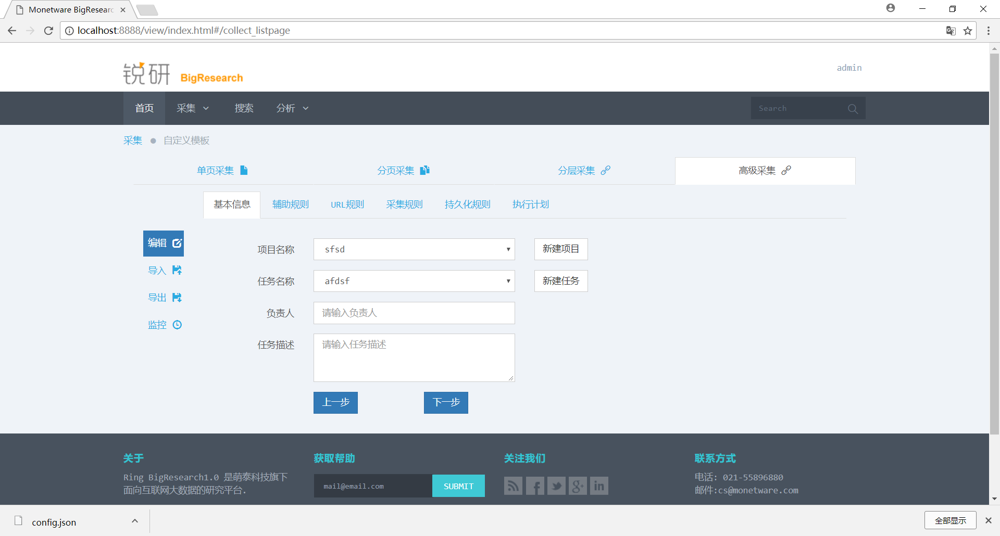
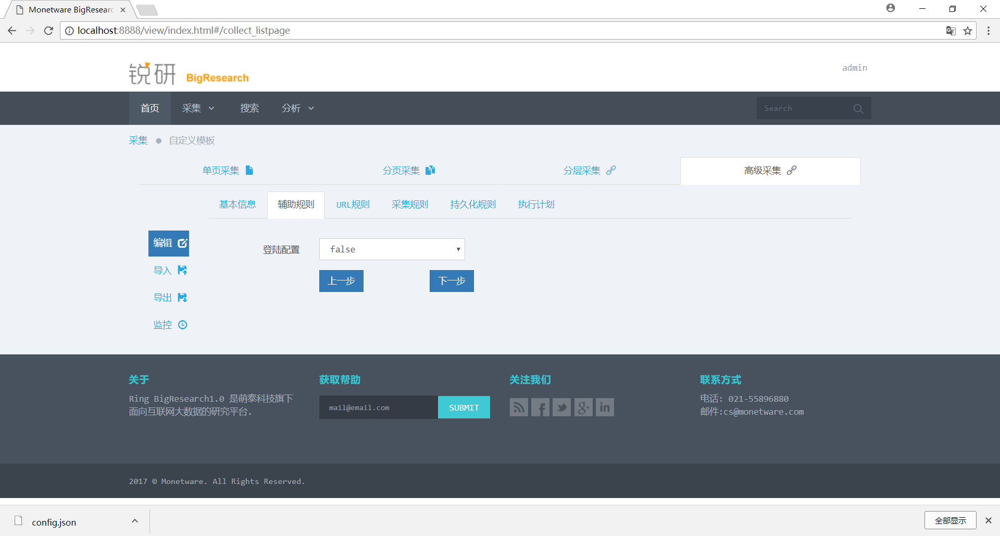
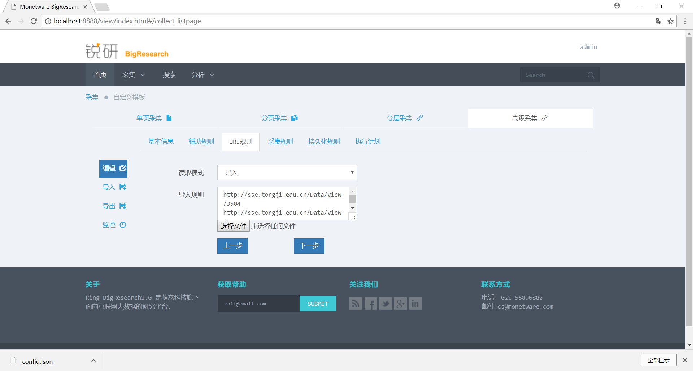
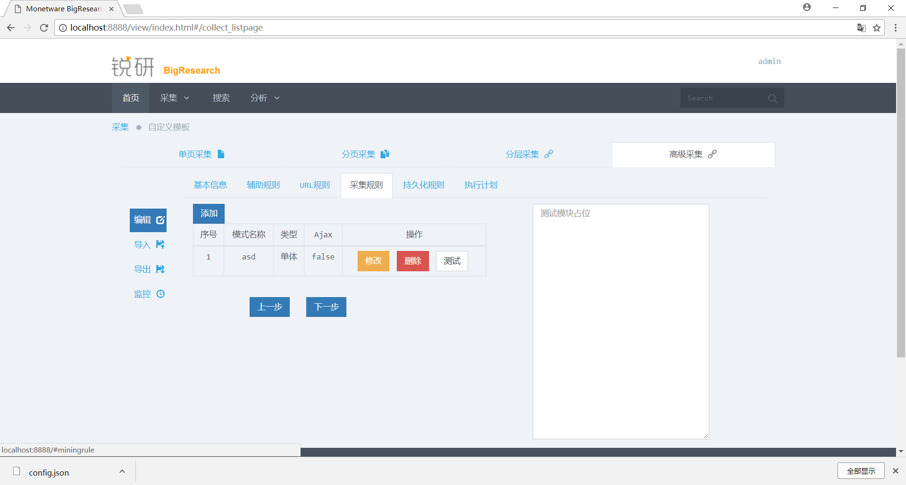
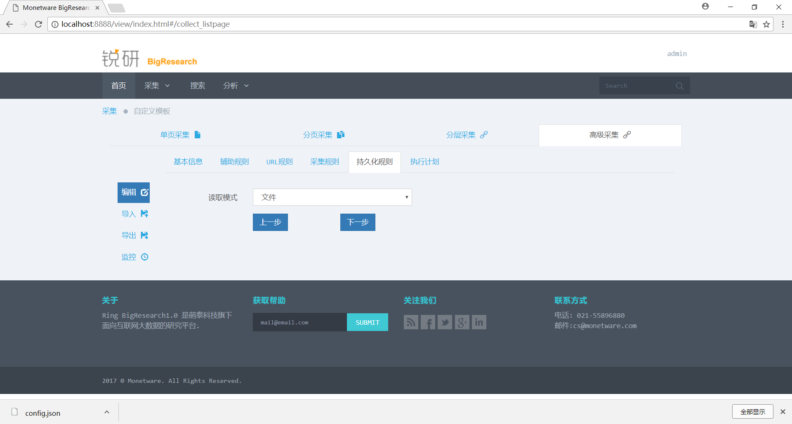
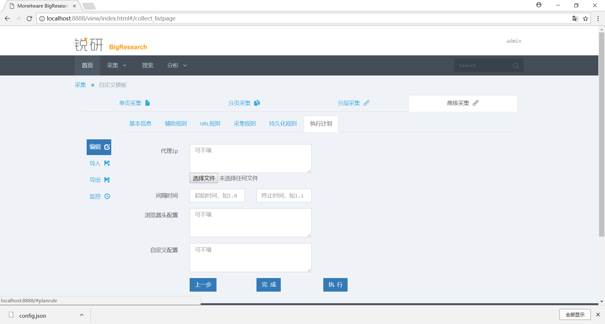
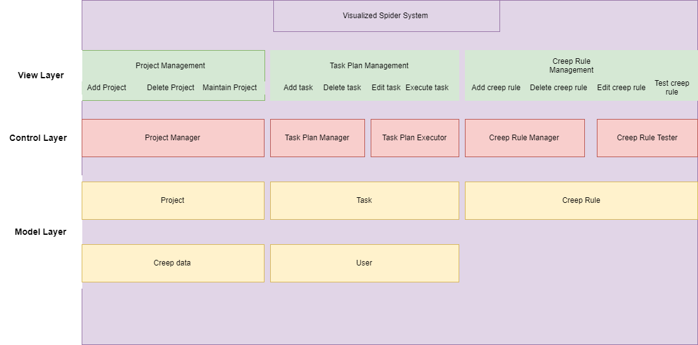
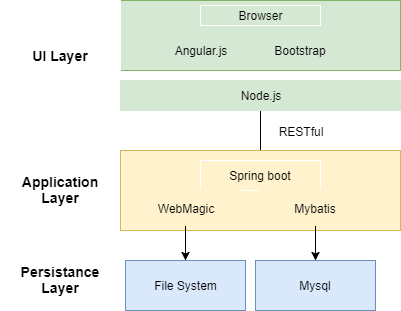
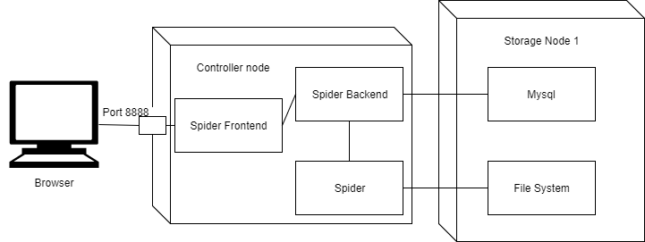
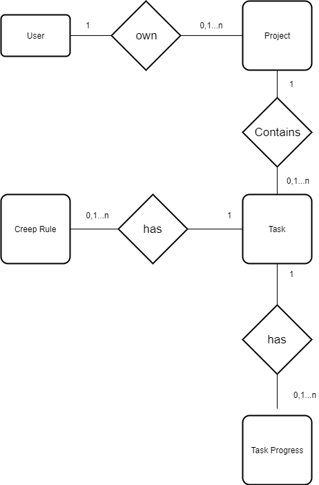

# High-level Design

## Prototype Design

Here's the UI design of the project













## Business Architecture

The business architecture outline the key components in each layers of the project systems. Here is the diagram:




## Technology Architecture

The architecture of the technology stacks (coding language, frameworks, libraries, styles, etc) used in the project. Here is the diagram:



## Deployment Topology

Deployment Topology shows how the whole project is deployed in the physical environment, including servers, VMs/containers, networks, key components, etc. A overview picture is required to show the topology. Here is the picture



## Data Models

### Entity-Relation Design

An Entity-Relation Diagram is required to show the concepts in the project and their relations. And for each entity and realtion, there should be a description after the diagram.

 E-R diagram:



### Database Design

According to the Entity-Realtion Design, the detailed database design for entities and relations should be listed as tables. 

**Table: User**

|  Column  |     Type     | Description          |
| :------: | :----------: | :------------------- |
|    id    |   integer    | key, identifier      |
| username | vaarchar[64] | username of the user |

**Table: Spider_Project_Info**

|    Column    |     Type     | Description                |
| :----------: | :----------: | :------------------------- |
|  project_id  |   integer    | key, identifier            |
| project_name | varchar[255] | name of the project        |
| create_time  |  timestamp   | create time of the project |

**Table: Spider_task_Info**

|        Column        |     Type     | Description                  |
| :------------------: | :----------: | :--------------------------- |
|       task_id        |   integer    | key, identifier              |
|      task_name       | varchar[255] | name of the task             |
|     task_leader      | varchar[127] | leader of the task           |
|   task_description   |     text     | discription of the task      |
| task_config_location | varchar[255] | the config file of the task  |
|     url_location     | varchar[255] | the url file of the task     |
|   content_location   | varchar[255] | the content file of the task |
|     create_time      | varchar[255] | the create time of the task  |

**Table: Spider_Project_Task**

|   Column   |  Type   | Description     |
| :--------: | :-----: | :-------------- |
| project_id | integer | key, identifier |
|  task_id   | integer | key,identifier  |

**Table: Spider_Progress_Info**

|     Column     |   Type    | Description                    |
| :------------: | :-------: | :----------------------------- |
|       id       |  integer  | key, identifier                |
|    task_id     |  integer  | the id of the task             |
| crawled_number |  integer  | the number of the crawled urls |
|      time      | timestamp | the current time               |


## Interface Specifications

The specifications of interfaces used in interactions among subsystems:

### *advance/getProjectsBasicInfo*   

#### Description

Get all basic information of a project.

|                |      |
| -------------- | ---- |
| Request Method | Get  |


#### Parameters

```
无
```

#### Responses

| Code | Description         | Schema             |
| :--: | :------------------ | :----------------- |
| 200  | Successful response | *list* : jsonArray |

#### Request Sample

```
advance/getProjectsBasicInfo
```

#### Response Sample

```
[{
	"project_id": 1,
	"project_name": "SSE",
	"create_time": 1515760747000
}, {
	"project_id": 2,
	"project_name": "TEST",
	"create_time": 1515760769000
}, {
	"project_id": 3,
	"project_name": "newly_created",
	"create_time": 1516355457000
}, {
	"project_id": 4,
	"project_name": "sdf",
	"create_time": 1516358261000
}, {
	"project_id": 5,
	"project_name": "sfsd",
	"create_time": 1516358483000
}]
```
### *advance/getProjectsDetailInfo*   

#### Description

Get the detailed information of project.

|                |      |
| -------------- | ---- |
| Request Method | Get  |

#### Parameters

```
None
```


#### Responses

| Code | Description         | Schema             |
| :--: | :------------------ | :----------------- |
| 200  | Successful response | *list* : jsonArray |

#### Request Sample

```
advance/getProjectsDetailInfo
```

#### Response Sample

```
[{
	"advanceProjectEntity": {
		"project_id": 1,
		"project_name": "SSE",
		"create_time": 1515760747000
	},
	"advanceTaskEntities": [{
		"task_id": 9,
		"task_name": "share",
		"create_time": null
	}]
}, {
	"advanceProjectEntity": {
		"project_id": 2,
		"project_name": "TEST",
		"create_time": 1515760769000
	},
	"advanceTaskEntities": [{
		"task_id": 1,
		"task_name": "sse-list",
		"create_time": null
	}]
}, {
	"advanceProjectEntity": {
		"project_id": 3,
		"project_name": "newly_created",
		"create_time": 1516355457000
	},
	"advanceTaskEntities": [{
		"task_id": 2,
		"task_name": "newly_created_task",
		"create_time": null
	}]
}, {
	"advanceProjectEntity": {
		"project_id": 4,
		"project_name": "sdf",
		"create_time": 1516358261000
	},
	"advanceTaskEntities": [{
		"task_id": 3,
		"task_name": "fsdf",
		"create_time": null
	}]
}, {
	"advanceProjectEntity": {
		"project_id": 5,
		"project_name": "sfsd",
		"create_time": 1516358483000
	},
	"advanceTaskEntities": [{
		"task_id": 4,
		"task_name": "afdsf",
		"create_time": null
	}]
}]
```
### *advance/createProject*   

#### Description

Create a Project

|                |      |
| -------------- | ---- |
| Request Method | Post |

#### Parameters

|     Name     | Located in | Description  | Required | Schema |
| :----------: | :--------: | :----------- | :------: | :----- |
| project_name |   query    | project name |   Yes    | string |


#### Responses

| Code | Description         | Schema                                   |
| :--: | :------------------ | :--------------------------------------- |
| 200  | Successful response | *code* : boolean <br/> *message* : string <br/> *newProject* : json |
| 200  | Fail response       | *code* : boolean <br/> *message* : string |

#### Request Sample

```
advance/createProject
```

#### Response Sample

```
{
	"code": true,
	"message": "新建项目成功",
	"newProject": {
		"advanceProjectEntity": {
			"project_id": 1,
			"project_name": "123",
			"create_time": "2018 - 01 - 09 21: 21: 09"
		},
		"advanceTaskEntities": [{
			"task_id": 1,
			"task_name ": "123 ",
			"create_time ": "2018 - 01 - 09 21: 40: 09 "
		}]
	}
}

```
### *advance/createTask*   

#### Description

Create a task

|                |      |
| -------------- | ---- |
| Request Method | Post |

#### Parameters

|    Name    | Located in | Description | Required | Schema |
| :--------: | :--------: | :---------- | :------: | :----- |
| project_id |   query    | project id  |   Yes    | int    |
| task_name  |   query    | task name   |   Yes    | string |


#### Responses

| Code | Description         | Schema                                   |
| :--: | :------------------ | :--------------------------------------- |
| 200  | Successful response | *code* : boolean <br/> *message* : string <br/> *newTask* : json <br/> *project_id* : int |
| 200  | Fail response       | *code* : boolean <br/> *message* : string <br/> |

#### Request Sample

```
advance/createTask
```

#### Response Sample

```
{
	"code": true,
	"message": "新建任务成功",
	"project_id": 2,
	"newTask": {
		"task_id": 1,
		"task_name": "123",
		"create_time": "2018 - 01 - 09 21: 40: 09"
	}
}
```

### *advance/uploadFile*   

#### Description

upload a file

|                |      |
| -------------- | ---- |
| Request Method | Post |

#### Parameters

| Name | Located in | Description    | Required | Schema |
| :--: | :--------: | :------------- | :------: | :----- |
| file |   query    | file to upload |   Yes    | file   |


#### Responses

| Code | Description         | Schema           |
| :--: | :------------------ | :--------------- |
| 200  | Successful response | *code* : boolean |

#### Request Sample

```
advance/uploadFile
```

#### Response Sample

```
{
	"code": true
}
```
### *advance/task_config*   

#### Description

Change the config of the task

|                |      |
| -------------- | ---- |
| Request Method | Post |

#### Parameters

|  Name  | Located in | Description | Required | Schema |
| :----: | :--------: | :---------- | :------: | :----- |
| config |   query    | task config |   Yes    | json   |

#### Responses

| Code | Description         | Schema           |
| :--: | :------------------ | :--------------- |
| 200  | Successful response | *code* : boolean |

#### Request Sample

```
advance/task_config
```

#### Response Sample

```
{
  "code" : true
}
```
### *advance/task_config*   

#### Description

Get the config of the task

|                |      |
| -------------- | ---- |
| Request Method | Get  |

#### Parameters

|  Name   | Located in | Description | Required | Schema |
| :-----: | :--------: | :---------- | :------: | :----- |
| task_id |   query    | task id     |   Yes    | int    |

#### Responses

| Code | Description         | Schema          |
| :--: | :------------------ | :-------------- |
| 200  | Successful response | *config* : json |

#### Request Sample

```
advance/task_config?task_id=24
```

#### Response Sample

```
{
  "code": "200"
}
```
### *collect/crawler*   

#### Description

Collect data with the clue pattern and Ajax flip

|                |      |
| -------------- | ---- |
| Request Method | Post |

#### Parameters

| Name | Located in | Description                 | Required | Schema |
| :--: | :--------: | :-------------------------- | :------: | :----- |
| data |   query    | the test creep rule of many |   Yes    | json   |


#### Responses

| Code | Description         | Schema         |
| :--: | :------------------ | :------------- |
| 200  | Successful response | *res* : string |

#### Request Sample

```
collect/clues
```

#### Response Sample

```
{
  "code": 200
}
```
### *collect/CrawledData*   

#### Description

Collect data with the single pattern and Ajax flip

|                |      |
| -------------- | ---- |
| Request Method | Post |

#### Parameters

|  Name   | Located in | Description            | Required | Schema |
| :-----: | :--------: | :--------------------- | :------: | :----- |
| request |   query    | the creep rule of test |   Yes    | json   |


#### Responses

| Code | Description         | Schema                |
| :--: | :------------------ | :-------------------- |
| 200  | Successful response | *testResult* : string |

#### Request Sample

```
collect/CrawledData
```

#### Response Sample

```
{
	"code": 200
}
```
### *CrawlPlan/Plan*   

#### Description

Execute the whole crawl plan task

|                |      |
| -------------- | ---- |
| Request Method | Post |

#### Parameters

|    Name    | Located in | Description          | Required | Schema |
| :--------: | :--------: | :------------------- | :------: | :----- |
| project_id |   query    | the id of th project |   Yes    | int    |
|  task_id   |   query    | the id of th task    |   Yes    | int    |


#### Responses

| Code | Description         | Schema        |
| :--: | :------------------ | :------------ |
| 200  | Successful response | *code* : true |

#### Request Sample

```
CrawlPlan/Plan
```

#### Response Sample

```
{
	"code": 200
}
```
### *progress/status*   

#### Description

Get the progress of all projects

|                |      |
| -------------- | ---- |
| Request Method | Get  |

#### Parameters

```
None
```

#### Responses

| Code | Description         | Schema               |
| :--: | :------------------ | :------------------- |
| 200  | Successful response | *result* : jsonArray |

#### Request Sample

```
progress/status
```

#### Response Sample

```
{
	"result": [{
		"process": 1.0,
		"project_id": 1,
		"crawled_urls": 1,
		"rate": 105.43580131208996,
		"nowtime": "2017-12-25 20:24:53",
		"total_urls": 1,
		"starttime": "2017-12-25 20:24:19",
		"timeprogresspoints": [{
			"time": "2017-12-25 20:25:00",
			"crawlednumber": 1
		}, {
			"time": "2017-12-25 20:26:00",
			"crawlednumber": 1
		}, {
			"time": "2017-12-25 20:27:00",
			"crawlednumber": 1
		}]
	}]
}
```
### *collect/download*   

#### Description

Get the download message of the given url

|                |      |
| -------------- | ---- |
| Request Method | Get  |

#### Parameters

|   Name   | Located in | Description  | Required | Schema |
| :------: | :--------: | :----------- | :------: | :----- |
| url_path |   query    | the url path |   Yes    | string |

#### Responses

| Code | Description         | Schema                 |
| :--: | :------------------ | :--------------------- |
| 200  | Successful response | *response* : "success" |

#### Request Sample

```
collect/download
```

#### Response Sample

```
{
	"code": 200
}
```
### *collect/file/exist*   

#### Description

Get exist message of given file name

|                |      |
| -------------- | ---- |
| Request Method | Get  |

#### Parameters

|   Name   | Located in | Description   | Required | Schema |
| :------: | :--------: | :------------ | :------: | :----- |
| filename |   query    | the file name |   Yes    | string |

#### Responses

| Code | Description         | Schema |
| :--: | :------------------ | :----- |
| 200  | Successful response | true   |

#### Request Sample

```
collect/file/exist
```

#### Response Sample

```
{
	"code": 200
}
```
